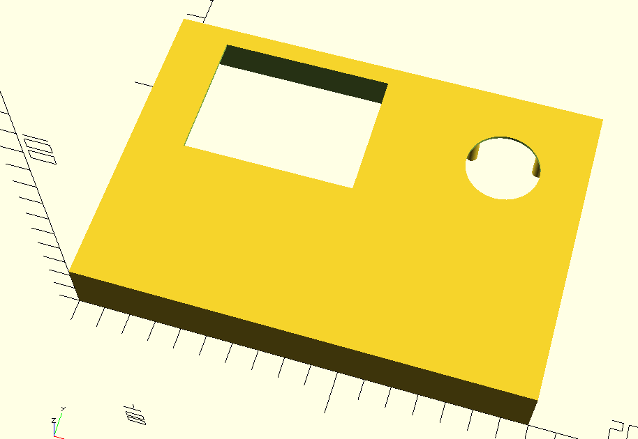
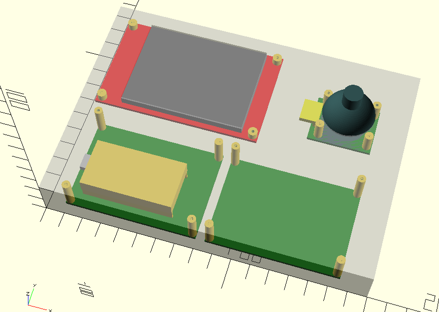
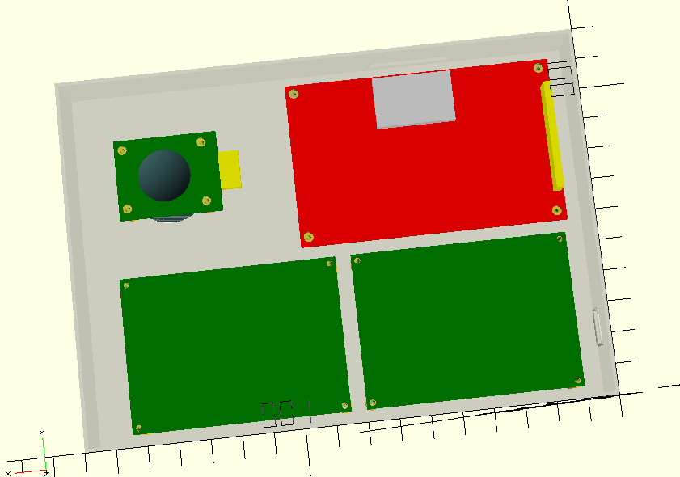

# CNC Controller Project
This is a simple ESP-32 based CNC controller board designed for parts that I have on-hand. The intention is to run FluidNC on it, with a few modifications.

The OpenSCAD source for the enclosure is included along with KiCAD schematic.

[Link to Schematic](https://github.com/pstoaks/esp_projects/tree/master/cnc_controller/doc/Schematic.pdf)

