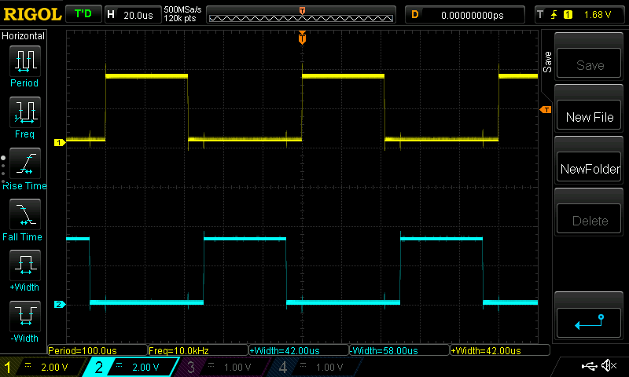
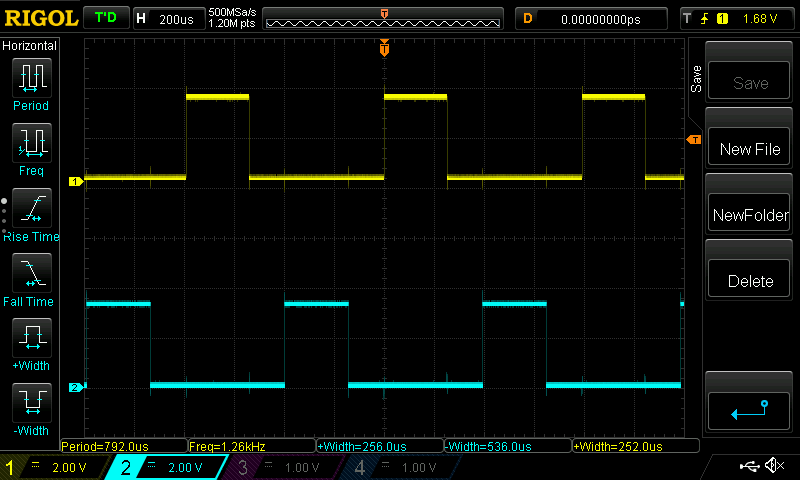

# Full Bridge PWM Driver

## Overview

I need a full bridge PWM gate driver for a high power inverter project I'm working on.

Sketch ***bit_banged_pwm*** is a pure software solution on the ESP8266.  Unfortunately,
the maximum usable PWM frequency is between 2 and 3kHz, and I want to experiment
with frequencies up to 10 kHz.  While this implementation may still be tuned for
better performance, it's clear that I would be better off looking at an alternative
solution.

Sketch ***esp32_pwm*** uses the Motor Control PWM (MCPWM) functionality built in to the
ESP32, and it works extremely well.  The sketch as written will support 500 Hz to
10 kHz and there are no interrupts, so the CPU should be available for other
functionality.  Note that adjusting the frequency causes the pulse-width to become
asymmetric (Q vs. Q_BAR), so duty cycle should be reset after adjusting the frequency.

The code includes links to useful resources, but I will reproduce a few of them
here as well:

* The original brushless DC motor control example I hacked up to create this
  sketch:  https://github.com/espressif/esp-idf/blob/7d0d2854d34844c7cfc49fc0604287c5e033f00b/examples/peripherals/mcpwm/mcpwm_bldc_control/main/mcpwm_bldc_control_hall_sensor_example.c
  This example had just a little too much in it to get my head around, so I have
  simplified it.  However, if you need an example of the capture interface for feedback,
  it's in this code.
* The MCPWM API: http://esp-idf.readthedocs.io/en/latest/api-reference/peripherals/mcpwm.html
* The ESP32 reference manual: http://espressif.com/sites/default/files/documentation/esp32_technical_reference_manual_en.pdf

Both sketches include support for a rotary encoder with a pushbutton to adjust
duty cycle and frequency at run-time. The push-button is on pin 0, so you could
just use the on-board GPIO0 button on your development board if your encoder
doesn't have a pushbutton.

These sketches are only intended to be simple educational examples.  I wish I
had time to build an Arduino library around the MCPWM, because it's super cool.

If I have time, I will upload a couple of videos showing the sketches in action.

