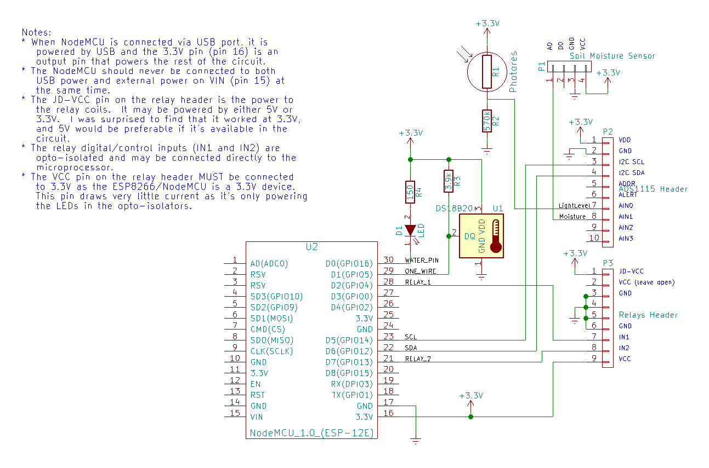

# The Simple ESP8266 Sensor Server

## Overview
Note: This is not yet complete.  I will be completing it in the coming week or so.

This is a very simple ESP8266 Arduino sketch that is written for the NodeMCU
and a few inexpensive, readily available sensors as an introduction to this
powerful, WiFi enabled microcontroller platform.

## What's needed:
* An ESP8266 development board: https://www.aliexpress.com/item/V3-Wireless-module-NodeMcu-4M-bytes-Lua-WIFI-Internet-of-Things-development-board-based-ESP8266-ESP/32801590957.html
* A breadboard is nice:  https://www.aliexpress.com/item/15982-Free-shipping-MB102-830-Point-Solderless-PCB-Breadboard-with-65pcs-Jump-Cable-Wires-and-Power/32359686534.html
* Need a great analog to digital converter: https://www.aliexpress.com/item/16-Bit-I2C-ADS1115-Module-ADC-4-channel-with-Pro-Gain-Amplifier-for-Arduino-RPi-1PCS/32817162654.html
* A couple of relays: https://www.aliexpress.com/item/Free-Shipping-1PCS-LOT-5V-2-Channel-Relay-Module-Shield-for-Ardui-ARM-PIC-AVR-DSP/32340779264.html
* A DS18B20 temperature sensor: https://www.aliexpress.com/item/Free-Shipping-1pcs-DS18B20-Stainless-steel-package-1-meters-waterproof-DS18b20-temperature-probe-temperature-sensor-18B20/32305869288.html
* OR https://www.aliexpress.com/item/Free-shipping-with-tracking-NO-10pcs-lot-DS18B20-TO-92/32510348570.html
* A photoresistor: https://www.aliexpress.com/item/Free-shipping-with-tracking-NO-10pcs-lot-DS18B20-TO-92/32510348570.html
* Soil moisture sensor: 
* A red LED
* A 150 ohm resistor
* A 3.3k or 3.9k ohm resistor
* A 570k resistor

## Instructions
Download the Arduino IDE: https://www.arduino.cc/en/Main/Software

Setup for programming the ESP8266 NodeMCU by following the instructions here:
https://github.com/esp8266/Arduino

Follow the instructions in the README.md file for **Installing with Boards Manager**

## Schematic

