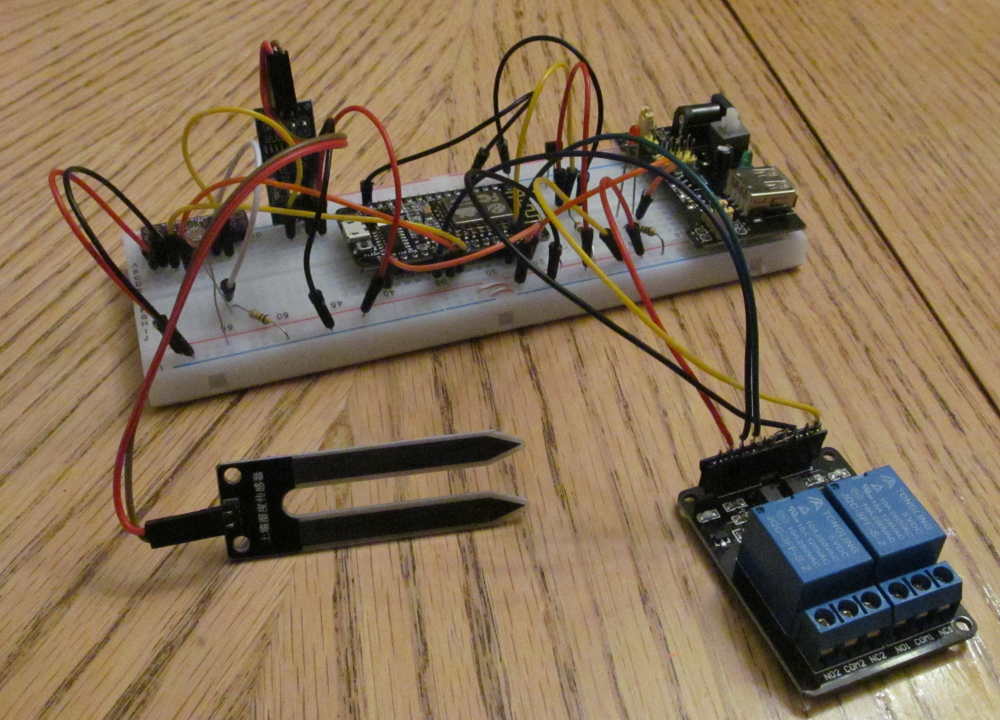
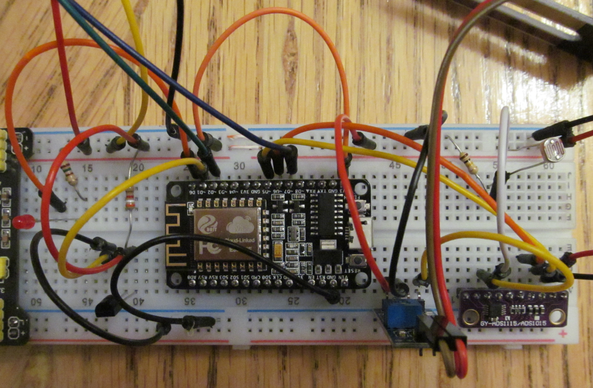

# The Simple ESP8266 Sensor Server

## Overview
Note: This is not yet complete.  I will be completing it in the coming week or so.

This is a very simple ESP8266 Arduino sketch that is written for the NodeMCU
and a few inexpensive, readily available sensors as an introduction to this
powerful, WiFi enabled microcontroller platform.

The kit I've put together includes the following (links to the necessary parts are included below
for those that don't have the kit.)
* A soil moisture sensor with an attached LED to indicate when the plant is dry and needs watering.
* A light sensor with an attached relay that might be used to control a light.  The relay turns on
when the light level drops below a threshold.
* A temperature sensor controlling an relay that might be used to control some kind of heater.  The
relay turns on when the temperature falls below a threshold.
* An on-board blue LED that blinks when the device is operating correctly.
* A 16-bit, 4 channel analog to digital converter with a programmable gain amplifier.  Two channels in use by the soil moisture sensor
and light sensor.

The sketch, as currently provided, sets up a Wi-Fi access point with a web server.  The web server
serves one page which provides the status of the sensors and relays.  This could be enhanced
to allow the modification of the thresholds and direct control of the relays.  (I might add that
if I get some free time from my other projects.)

## What's needed:  (Note that I am not affiliated in any way with AliExpress.  I just buy a lot of parts from them.
* A NodeMCU compatible ESP8266 development board: https://www.aliexpress.com/item/V3-Wireless-module-NodeMcu-4M-bytes-Lua-WIFI-Internet-of-Things-development-board-based-ESP8266-ESP/32801590957.html
* A breadboard is nice:  https://www.aliexpress.com/item/15982-Free-shipping-MB102-830-Point-Solderless-PCB-Breadboard-with-65pcs-Jump-Cable-Wires-and-Power/32359686534.html
* Need a great analog to digital converter: https://www.aliexpress.com/item/16-Bit-I2C-ADS1115-Module-ADC-4-channel-with-Pro-Gain-Amplifier-for-Arduino-RPi-1PCS/32817162654.html
* A couple of relays: https://www.aliexpress.com/item/Free-Shipping-1PCS-LOT-5V-2-Channel-Relay-Module-Shield-for-Ardui-ARM-PIC-AVR-DSP/32340779264.html
* A DS18B20 temperature sensor: https://www.aliexpress.com/item/Free-Shipping-1pcs-DS18B20-Stainless-steel-package-1-meters-waterproof-DS18b20-temperature-probe-temperature-sensor-18B20/32305869288.html
* OR https://www.aliexpress.com/item/Free-shipping-with-tracking-NO-10pcs-lot-DS18B20-TO-92/32510348570.html
* A photoresistor: https://www.aliexpress.com/item/Free-shipping-with-tracking-NO-10pcs-lot-DS18B20-TO-92/32510348570.html
* Soil moisture sensor: https://www.aliexpress.com/item/Free-Shipping-Soil-Hygrometer-Humidity-Detection-Module-Moisture-Water-Sensor-Soil-moisture-for-Arduino/32704803481.html
* A red LED
* A 150 ohm resistor
* A 3.3k or 3.9k ohm resistor
* A 570k resistor

## Arduino IDE Setup Instructions (required for programming the NodeMCU)

The NodeMCU in your kit has already been programmed with the sketch.  However, you will
want to make it your own by modifying the program as desired.  To do that, you need
the Arduino IDE.  

Download the Arduino IDE: https://www.arduino.cc/en/Main/Software

Setup for programming the ESP8266 NodeMCU by following the instructions here:
https://github.com/esp8266/Arduino

Follow the instructions in the README.md file for **Installing with Boards Manager**

Connect a micro-USB cable from your computer to the ESP8266 development board.  This will
power the board and should connect to the device.  The development board will appear to the
USB hub on the computer as a Serial Port.  Look under the Tools menu in the Arduino IDE and the
development board should show up under the Port sub-menu.  Select the appropriate port.

Open the Serial Monitor under the Tools menu, set the Baud Rate to 115200 and press the reset
button the ESP8266 development board.  If the device has the sketch loaded on it, you should
see some meaningful output.  If not, you should see some garbage.  In either case, you'll
know that you have a good connection to the board.

The device programmer settings are in the Tools menu.  I recommend the following for NodeMCU
compatible boards like the one I recommended above (settings not listed may be left at default):
* Board: "NodeMCU 1.0 (ESP-12E module)"
* Flash Size: "4M (1M SPIFFS)"  Note that the amount of SPIFFS is not important for this sketch
     and you may need to change it for future projects.)
* lwIP Variant: "v2"
* CPU Frequency: "80 MHz"
* Upload Speed: "115200" <-- Feel free to experiment.

This project requires a few Arduino libraries.  Libraries are installed using the Include Library
menu under the Sketch menu.  Choose Manage Libraries, and install the following libraries:
* DallasTemperature
* Adafruit ADS1X15

You can now download the web_server_kit (or write your own) sketch and load it onto the board.  The sketch is simply
a program that utilizes the Arduino library.  It's source code that is compiled and linked into an image
when you select Verify/Compile from the Sketch menu.  The Upload entry in the Sketch menu compiles
the program and, if there are no errors, uploads it to the device.

Note that you can find many examples included with the Arduino IDE.  I definitely recommend exploring.
The examples are in the Examples sub-menu under the File menu.  There are many that are ESP8266
specific.

There are many, many resources around the Internet for the Arduino ecosystem and the ESP8266.  I
recommend finding a YouTube video or two to get you comfortable.  I have been doing software
development for almost 30 years, but I learned Arduino from a 15 year-old on YouTube.  I think
that's awesome!

For those of you who have software development experience, the language used in the Arduino IDE is
C++11.  Many features of the STL are not available, but otherwise you can program entirely in
C++.  There are also ESP8266 development environments for LUA, and MicroPython has been ported,
which I think is super-cool but have not yet tried.  More here: https://docs.micropython.org/en/latest/esp8266/esp8266/tutorial/intro.html

***If you get an error message when connecting or the port does not show up in the Ports menu.***

I have heard that you may have trouble with
connecting to the USB port on the development board with Windows.  If this occurs, you will need to
find the correct driver for the on-board USB to Serial chip.  To find the correct driver,
find the part number on the chip closest to the USB port and google for a Windows device
driver for it.  The chip on my NodeMCU clone is the CH340G and the driver can be found here:
http://www.arduined.eu/ch340g-converter-windows-7-driver-download/

You will probably need to reboot Windows and restart the Arduino IDE after installing the device
driver.

## Connections

NOTE:  The wires included with the breadboard shown above sometimes have a non-conductive coating
still on the metal tips.  This can interfere with the electrical connections and should be removed.
I removed it by simply scraping them with my fingernail.

The schematic (wiring diagram) is shown below.  Working with these devices is
very simple as they require very few external components to use.  I am including a photo of my
wiring below.  This is not the most efficient layout, but it may help if you are having trouble.

Start by inserting the ESP8266 development board into the breadboard, then the DS18B20 temperature sensor,
the analog to digital converter module (ADS1115), soil moisture sensor PCB, the photoresistor, three resistors, and red LED.

Connecting up the circuit is probably easier if you think in terms of the major connections first.
This project uses two "buses".  A bus is a way to connect one or more devices to the microcontroller
using a fixed set of pins for each bus.

* The OneWire bus connects the DS18B20 temperature sensor.  This is a serial bus that connects
the temperature sensor's data pin to D1 (GPIO5) on the microcontroller.  Multiple sensors could be attached to this bus. Note that there is a 3.3k pull-up resistor between teh data pin and 3.3V.
* The I2C bus connects the analog to digital converter module.  This is a serial bus that requires
two pins, one for data (SDA) and the other for the clock (SCL).  In this project, the I2C bus is assigned to
pins D5 (GPIO14) and D6 (GPIO4).  The ADS1115 has the necessary pull-up resistors, so no additional
components are required here.

Connecting those two buses and power and ground as shown in the schematic will get you most of the
way there.

Complete the wiring by connecting the LED, light sensor (photo resistor) and their resistors as shown,
then connecting the two relay input pins to the microcontroller's output pins.

Loads can be connected to the screw terminals on the relays as desired.  LEDs on the relay module PCB
will light when a relay is 'on'.

## Connecting Via WiFi

When the device is powered on and running, the blue LED on the development will blink.  A small amount
of startup information is also sent to the USB port, which can be monitored on the Serial Monitor in
the Arduino IDE.

The device creates a WiFi network with an SSID (name) of Sens_AP.  You should be able to find and connect to this network
using your computer or phone.  Once connected, type ***https://192.168.4.1/" into your browser and you 
should see the device's webpage with information from each of the sensors and the status of the relays.

If the values from the sensors do not appear to be changing, double-check the wiring for the data pins
and power.  Touching the temperature sensor with your fingers is a good way to see temperature changes.
Covering and uncovering the light sensor will yield changes there.  A moist paper towel can be used to
test the soil moisture sensor.

If there are any questions (or bugs), please let me know by filing an issue.  Pull requests are welcome!

## Schematic

