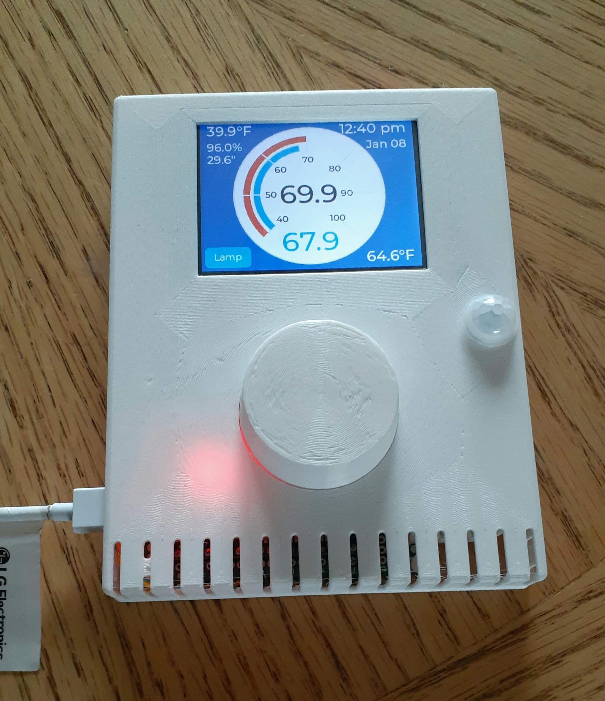
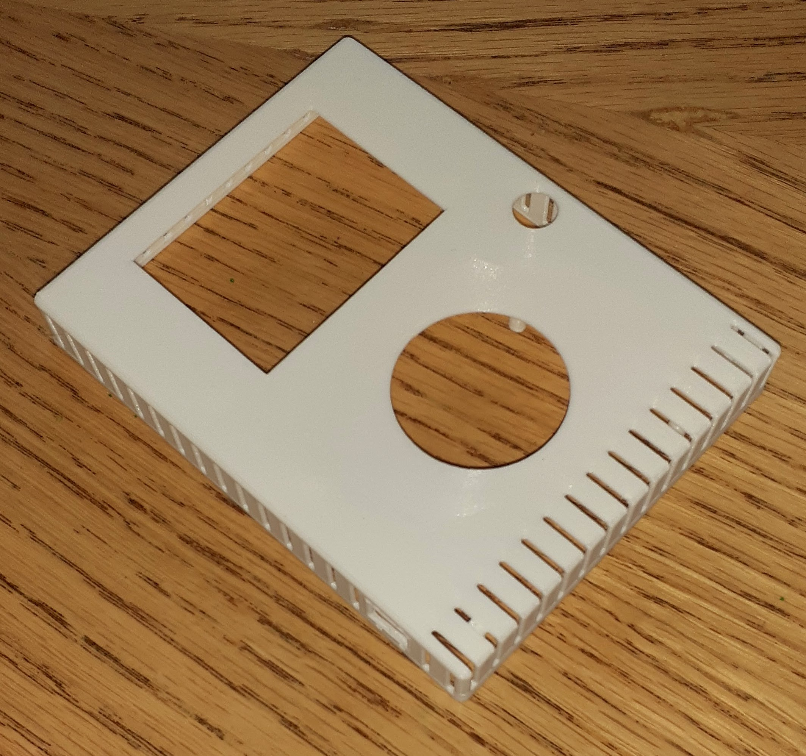
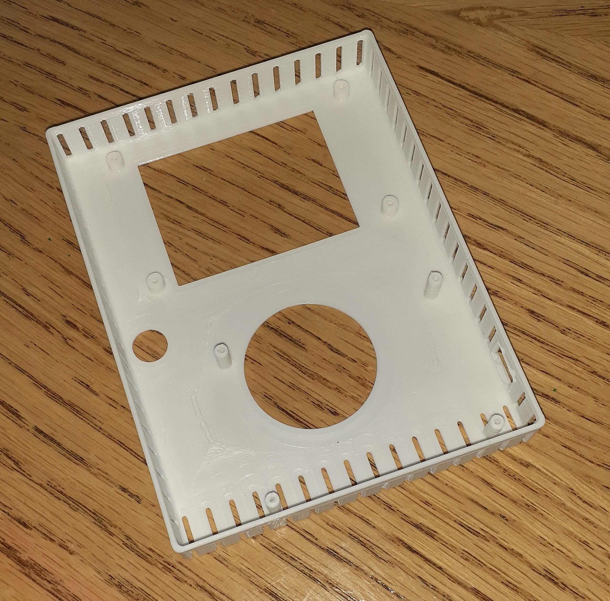

# Thermostat Project
This is a thermostat-type controller that I am developing for my homemade home
automation system. It is still very much in-progress. Only basic functionality is
currently implemented and the code is mostly in a 'how does it work' state. I am
beginning to refactor the implementation to make it easier to maintain and
enhance.

The microcontroller is an ESP32 on a NodeMCU clone dev board. The GUI is implemented
using LVGL. The OpenSCAD source for the enclosure is included along with KiCAD schematic.

[Schematic](https://github.com/pstoaks/esp_projects/tree/master/thermostat/doc/Schematic.pdf)
